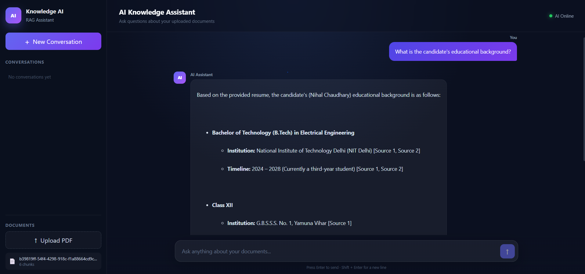
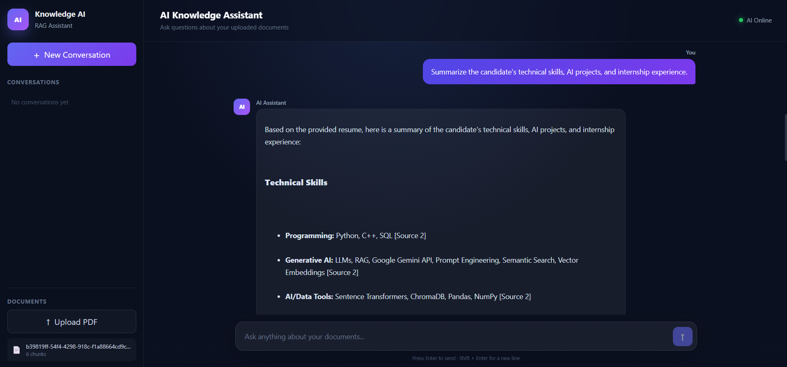
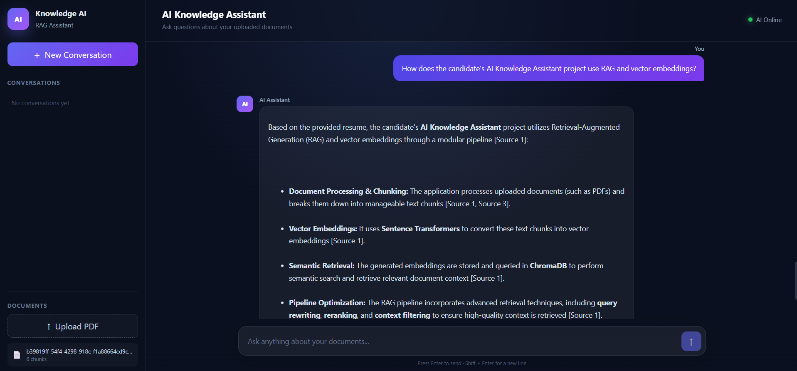

# 🧠 AI Knowledge Assistant

<p align="center">
  <strong>Full-Stack Retrieval-Augmented Generation (RAG) Knowledge System</strong>
</p>

<p align="center">
  Upload documents, search them semantically, and interact with them using natural language.
</p>

<p align="center">


</p>

---

## 📖 Table of Contents

- [Overview](#-overview)
- [Problem Statement](#-problem-statement)
- [Solution](#-solution)
- [Features](#-features)
- [Application Preview](#-application-preview)
- [Architecture](#-architecture)
- [RAG Pipeline](#-rag-pipeline)
- [Document Processing](#-document-processing)
- [Embeddings and Vector Database](#-embeddings-and-vector-database)
- [Retrieval and Reranking](#-retrieval-and-reranking)
- [Memory and Conversations](#-memory-and-conversations)
- [Response Caching](#-response-caching)
- [Backend](#-backend)
- [Frontend](#-frontend)
- [REST API](#-rest-api)
- [Project Structure](#-project-structure)
- [Technology Stack](#-technology-stack)
- [Installation](#-installation)
- [Environment Variables](#-environment-variables)
- [Running the Application](#-running-the-application)
- [Docker](#-docker)
- [Testing and Evaluation](#-testing-and-evaluation)
- [Security](#-security)
- [Limitations](#-limitations)
- [Future Improvements](#-future-improvements)
- [Example Questions](#-example-questions)
- [Project Highlights](#-project-highlights)
- [Author](#-author)

---

# 🚀 Overview

**AI Knowledge Assistant** is a full-stack AI application that allows users to upload documents and ask questions about their contents through a conversational interface.

The application uses **Retrieval-Augmented Generation (RAG)** to retrieve relevant information from uploaded documents before generating an answer using Google Gemini.

### Main Workflow

```text
Documents
    ↓
PDF Processing
    ↓
Chunking
    ↓
Vector Embeddings
    ↓
ChromaDB
    ↓
User Query
    ↓
Query Normalization
    ↓
Query Rewriting
    ↓
Semantic Retrieval
    ↓
Cross-Encoder Reranking
    ↓
Context Filtering
    ↓
Google Gemini
    ↓
Answer + Sources + Metrics
```

---

# ❓ Problem Statement

A general-purpose LLM does not automatically have access to a user's private documents.

Users may want to ask questions about:

- Resumes
- Research papers
- Technical documentation
- Project reports
- Notes
- PDF files

Sending an entire document to an LLM for every question can be inefficient and may provide unnecessary context.

This project solves the problem by creating a searchable knowledge base using document processing, embeddings, semantic retrieval, reranking, context filtering, and LLM generation.

---

# 💡 Solution

```text
DOCUMENT SIDE

Document
   ↓
Text Extraction
   ↓
Chunking
   ↓
Embedding Model
   ↓
ChromaDB
   ↓
Knowledge Base


QUERY SIDE

User Question
   ↓
Query Processing
   ↓
Vector Retrieval
   ↓
Reranking
   ↓
Context Filtering
   ↓
Google Gemini
   ↓
Final Answer
```

---

# ✨ Features

### 📄 Document Processing
- PDF/document upload
- PDF text extraction
- Document chunking
- Metadata handling
- Vector storage

### 🔎 Retrieval
- Semantic search
- Vector embeddings
- ChromaDB
- Cross-Encoder reranking
- Context filtering

### 🤖 Generative AI
- Google Gemini API
- Retrieval-Augmented Generation
- Context-aware responses
- Source attribution

### 💬 Conversational AI
- Conversation history
- Follow-up questions
- Conversation summaries
- Persistent memory

### ⚡ Performance
- Response caching
- Pipeline metrics
- Logging
- Health checks
- API retry support

### 🌐 Full Stack
- React frontend
- FastAPI backend
- REST APIs
- Docker configuration
- Testing/evaluation structure

---

# 🖥️ Application Preview

## Educational Background



## Technical Skills and Experience



## RAG and Vector Embeddings



---

# 🏗️ Architecture

```text
┌───────────────────────────────────────┐
│             React Frontend            │
│                                       │
│ ChatWindow │ Message │ ChatInput      │
│ Sidebar    │ SourceCard               │
└───────────────────┬───────────────────┘
                    │
                 REST API
                    │
                    ▼
┌───────────────────────────────────────┐
│            FastAPI Backend             │
│                                       │
│ Chat │ Documents │ Conversations      │
│ Health                               │
└───────────────────┬───────────────────┘
                    │
                    ▼
┌───────────────────────────────────────┐
│           Application Services         │
│                                       │
│ Chat Service                           │
│ Conversation Management               │
│ Memory Management                     │
│ Response Cache                         │
└───────────────────┬───────────────────┘
                    │
                    ▼
┌───────────────────────────────────────┐
│              RAG Pipeline              │
│                                       │
│ Normalize → Rewrite → Retrieve        │
│ → Rerank → Filter → Generate          │
└───────────────┬───────────┬───────────┘
                │           │
                ▼           ▼
          ┌──────────┐ ┌───────────┐
          │ ChromaDB │ │  Gemini   │
          │  Vector  │ │    LLM    │
          │   Store  │ │           │
          └──────────┘ └───────────┘
```

---

# 🔄 RAG Pipeline

The main orchestration is implemented in `rag_pipeline.py`.

```text
User Query
    ↓
Query Normalization
    ↓
Query Rewriting
    ↓
Document Retrieval
    ↓
Cross-Encoder Reranking
    ↓
Context Filtering
    ↓
Response Generation
```

### Query Normalization
Prepares the user's query before retrieval.

### Query Rewriting
Transforms the query into a retrieval-oriented representation.

### Semantic Retrieval
Searches document embeddings stored in ChromaDB.

### Reranking
Uses a Cross-Encoder to improve the ordering of retrieved chunks.

### Context Filtering
Selects useful context before generation.

### Generation
Provides the selected context to Google Gemini.

---

# 📄 Document Processing

```text
Upload
  ↓
Document Loader
  ↓
PDF/Text Processing
  ↓
Chunking
  ↓
Embedding Generation
  ↓
Metadata
  ↓
ChromaDB
```

The project uses `pypdf` for PDF processing.

---

# 🧮 Embeddings and Vector Database

Sentence Transformers are used to generate vector embeddings.

```text
Text
 ↓
Embedding Model
 ↓
Numerical Vector
 ↓
ChromaDB
```

During retrieval:

```text
User Query
    ↓
Query Embedding
    ↓
ChromaDB Similarity Search
    ↓
Relevant Document Chunks
```

Important modules:

```text
document_embedder.py
document_store.py
document_retriever.py
```

---

# 🎯 Retrieval and Reranking

The project uses a two-stage retrieval approach:

```text
Vector Search
     ↓
Candidate Documents
     ↓
Cross-Encoder Reranking
     ↓
Better Ranked Documents
     ↓
Context Filtering
```

Vector search provides semantic candidate retrieval, while reranking improves the ordering of retrieved content.

---

# 🧠 Memory and Conversations

The application maintains conversation history and a separate memory system.

```text
                 Chat Request
                      │
          ┌───────────┴───────────┐
          ▼                       ▼
Conversation History          Memory
          │                       │
          └───────────┬───────────┘
                      ▼
                RAG Pipeline
                      │
                      ▼
                  Response
```

Important modules:

```text
conversation_manager.py
conversation_summary_manager.py
memory_manager.py
memory_processor.py
memory_retriever.py
```

---

# ⚡ Response Caching

```text
User Query
    ↓
Cache Check
    │
    ├── Cache Hit → Cached Response
    │
    └── Cache Miss
           ↓
       RAG Pipeline
           ↓
         Gemini
           ↓
       Cache Result
```

Implemented in:

```text
response_cache.py
```

---

# 📊 Metrics and Logging

The project includes pipeline statistics, logging, and health checks.

```text
Request
   ↓
Pipeline
   ↓
Metrics + Logs
```

Important modules:

```text
pipeline_stats.py
logging_config.py
health.py
```

---

# 🏢 Backend

The backend is built with **FastAPI**.

```text
backend/
├── api/
├── models/
├── services/
├── dependencies.py
└── main.py
```

The backend provides APIs for:

- Chat
- Document upload
- Conversations
- Health checks

Main chat orchestration:

```text
backend/services/chat_service.py
```

---

# ⚛️ Frontend

The frontend is built using **React + Vite**.

Important components include:

```text
ChatWindow.jsx
ChatInput.jsx
Message.jsx
SourceCard.jsx
Sidebar.jsx
```

The frontend handles:

- Chat messages
- API requests
- Loading states
- Conversation IDs
- Error handling
- Source display
- Document-related UI

---

# 🔌 REST API

| Method | Endpoint | Purpose |
|---|---|---|
| `POST` | `/api/chat/` | Send chat query |
| `POST` | `/api/conversations/` | Create conversation |
| `GET` | `/api/conversations/{id}` | Get conversation |
| `DELETE` | `/api/conversations/{id}` | Delete conversation |
| `POST` | `/api/documents/upload` | Upload document |
| `GET` | `/api/health` | Health check |

### Example Request

```json
{
  "query": "What is the candidate's educational background?",
  "conversation_id": null
}
```

FastAPI documentation:

```text
http://localhost:8000/docs
```

---

# 🗂️ Project Structure

```text
ai-knowledge-assistant-rag/
│
├── backend/
│   ├── api/
│   ├── models/
│   ├── services/
│   ├── dependencies.py
│   └── main.py
│
├── frontend/
│   ├── services/
│   ├── src/
│   │   ├── components/
│   │   └── services/
│   ├── index.html
│   ├── package.json
│   └── vite.config.js
│
├── evaluation/
├── tests/
├── data/
├── temp/
│
├── .github/
├── .dockerignore
├── .env.example
├── .gitignore
├── Dockerfile
├── docker-compose.yml
├── requirements.txt
│
├── config.py
├── document_loader.py
├── document_embedder.py
├── document_store.py
├── document_retriever.py
├── pdf_processor.py
├── reranker.py
├── context_filter.py
├── query_normalizer.py
├── query_rewriter.py
├── rag_pipeline.py
├── rag_generator.py
├── gemini_client.py
├── conversation_manager.py
├── conversation_summary_manager.py
├── memory_manager.py
├── memory_processor.py
├── memory_retriever.py
├── response_cache.py
├── pipeline_stats.py
├── health.py
├── logging_config.py
├── api.py
├── api_retry.py
└── main.py
```

---

# 🧩 Important Modules

| File | Responsibility |
|---|---|
| `document_loader.py` | Loads documents |
| `pdf_processor.py` | Processes PDF content |
| `document_embedder.py` | Generates embeddings |
| `document_store.py` | Manages vector storage |
| `document_retriever.py` | Semantic retrieval |
| `reranker.py` | Cross-Encoder reranking |
| `context_filter.py` | Context filtering |
| `query_normalizer.py` | Query normalization |
| `query_rewriter.py` | Query rewriting |
| `rag_pipeline.py` | RAG orchestration |
| `rag_generator.py` | Response generation |
| `gemini_client.py` | Gemini API integration |
| `conversation_manager.py` | Conversation management |
| `conversation_summary_manager.py` | Conversation summaries |
| `memory_manager.py` | Memory management |
| `memory_processor.py` | Memory processing |
| `memory_retriever.py` | Memory retrieval |
| `response_cache.py` | Response caching |
| `pipeline_stats.py` | Pipeline metrics |
| `health.py` | Health checks |
| `logging_config.py` | Logging |

---

# 🛠️ Technology Stack

### AI / RAG
- Google Gemini
- Sentence Transformers
- ChromaDB
- Cross-Encoder Reranking

### Backend
- Python
- FastAPI
- Pydantic
- Uvicorn

### Frontend
- React
- JavaScript
- Vite

### Data Processing
- pypdf
- NumPy
- Pandas

### Infrastructure
- Docker
- Git
- GitHub

---

# 📦 Installation

## 1. Clone Repository

```bash
git clone https://github.com/nihallchaudhary/ai-knowledge-assistant-rag.git
cd ai-knowledge-assistant-rag
```

## 2. Create Virtual Environment

### Windows

```bash
python -m venv venv
venv\Scriptsctivate
```

### Linux/macOS

```bash
python3 -m venv venv
source venv/bin/activate
```

## 3. Install Backend Dependencies

```bash
pip install -r requirements.txt
```

## 4. Install Frontend Dependencies

```bash
cd frontend
npm install
cd ..
```

---

# 🔐 Environment Variables

Create a `.env` file based on `.env.example`.

```env
GEMINI_API_KEY=your_api_key_here
```

For the frontend:

```env
VITE_API_BASE_URL=http://localhost:8000
```

**Never commit `.env` or real API keys to GitHub.**

---

# ▶️ Running the Application

## Start Backend

From the project root:

```bash
python -m uvicorn backend.main:app --reload
```

Backend:

```text
http://localhost:8000
```

API documentation:

```text
http://localhost:8000/docs
```

## Start Frontend

Open another terminal:

```bash
cd frontend
npm install
npm run dev
```

Vite will display the frontend URL in the terminal.

---

# 🐳 Docker

The project includes:

```text
Dockerfile
docker-compose.yml
```

Build and run:

```bash
docker compose build
docker compose up
```

Stop:

```bash
docker compose down
```

---

# 🧪 Testing and Evaluation

The repository contains:

```text
tests/
evaluation/
```

Useful evaluation areas include:

- Retrieval relevance
- Ranking quality
- Context quality
- Answer relevance
- Grounding
- Response latency

---

# 🔒 Security

Do not commit:

```text
.env
venv/
.venv/
node_modules/
data/chroma_db/
temp/
uploads/
__pycache__/
*.pyc
```

Personal documents should also remain outside a public repository unless intentionally published.

Use `.env.example` to document required configuration without exposing secrets.

---

# ⚠️ Limitations

The current project focuses on the core RAG architecture.

Current limitations include:

- No complete authentication system
- Local vector storage
- Limited multi-user isolation
- No advanced hybrid retrieval
- No token streaming
- OCR may be required for scanned PDFs
- Large-scale document processing would require additional infrastructure

---

# 🚀 Future Improvements

Potential improvements include:

- 🔐 Authentication and authorization
- 👥 Multi-user knowledge bases
- 🔀 Hybrid keyword + vector search
- 📡 Streaming LLM responses
- 🖼️ Multimodal document support
- ☁️ Cloud deployment
- 📊 Advanced RAG evaluation
- 🧠 Improved long-term memory
- ⚙️ Background document processing
- 📈 Advanced monitoring

---

# 💬 Example Questions

```text
What is the candidate's educational background?
```

```text
What technical skills does the candidate have?
```

```text
Summarize the candidate's AI projects.
```

```text
What internships has the candidate completed?
```

```text
Which skills are relevant for a Generative AI Engineer role?
```

```text
How does the candidate's AI Knowledge Assistant project use RAG and vector embeddings?
```

### Follow-Up Example

```text
User:
What is the candidate's highest qualification?

AI:
B.Tech in Electrical Engineering.

User:
Which institute did they attend?

AI:
NIT Delhi.
```

---

# ⭐ Project Highlights

- ✅ Retrieval-Augmented Generation
- ✅ Large Language Model integration
- ✅ Vector embeddings
- ✅ Semantic search
- ✅ ChromaDB
- ✅ Cross-Encoder reranking
- ✅ Context filtering
- ✅ Query normalization
- ✅ Query rewriting
- ✅ Conversational context
- ✅ Persistent memory
- ✅ Response caching
- ✅ Source attribution
- ✅ FastAPI REST APIs
- ✅ React frontend
- ✅ Docker
- ✅ Logging
- ✅ Health checks
- ✅ Testing and evaluation structure

---

# 📌 Project Status

| Component | Status |
|---|---|
| Document Upload | ✅ |
| PDF Processing | ✅ |
| Chunking | ✅ |
| Embeddings | ✅ |
| ChromaDB | ✅ |
| Semantic Retrieval | ✅ |
| Query Normalization | ✅ |
| Query Rewriting | ✅ |
| Reranking | ✅ |
| Context Filtering | ✅ |
| Gemini Generation | ✅ |
| Source Attribution | ✅ |
| Conversations | ✅ |
| Persistent Memory | ✅ |
| Response Cache | ✅ |
| Pipeline Metrics | ✅ |
| FastAPI Backend | ✅ |
| React Frontend | ✅ |
| Docker Configuration | ✅ |
| Testing/Evaluation | ✅ |

---

# 🎓 What This Project Demonstrates

```text
Python
   +
REST APIs
   +
FastAPI
   +
React
   +
LLM APIs
   +
RAG
   +
Embeddings
   +
Vector Databases
   +
Semantic Search
   +
Reranking
   +
Context Engineering
   +
Conversational AI
   +
Memory
   +
Caching
   +
Docker
   +
Git/GitHub
```

The project demonstrates how these technologies can be combined into a complete AI application rather than using an LLM as an isolated chatbot.

---

# 👨‍💻 Author

## Nihal Chaudhary

Electrical Engineering Student  
NIT Delhi

GitHub:

https://github.com/nihallchaudhary

---

# 📄 License

This project is intended for educational, portfolio, and demonstration purposes.

If you plan to distribute the project for reuse, add an appropriate open-source license to the repository.

---

# ⭐ Conclusion

**AI Knowledge Assistant** demonstrates a practical implementation of a modern RAG-based AI application.

```text
Documents
    ↓
Embeddings
    ↓
Vector Database
    ↓
Semantic Retrieval
    ↓
Reranking
    ↓
Context Filtering
    ↓
LLM Generation
    ↓
Sources + Response
```

Built with:

```text
React + FastAPI + Gemini + ChromaDB + Sentence Transformers + Docker
```

The project combines AI engineering concepts with software engineering practices to create a complete document-based conversational AI system.
